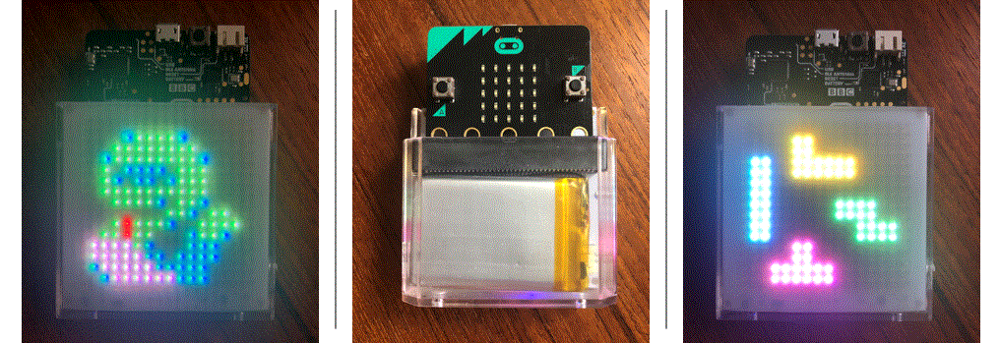

## Games for BBC micro:bit with Sparklet Shield

This project uses the [Sparklet for the micro:bit](https://siliconsquared.com/sparkletmicrobit/) which features a 16x16 matrix of colorful Neopixels. Click on the banner above for a [video demonstration](https://www.youtube.com/watch?v=VbkmTn-2-Kg).

## Run/Edit this project 

To edit this repository in MakeCode.

* open [https://makecode.microbit.org/](https://makecode.microbit.org/)
* click on **Import** then click on **Import URL**
* paste **https://github.com/tballmsft/microbitsparkletgames** and click import

## Instructions

- Press either A/B button when you see the game you would like to play (snake or blocks)
- Snake game: A/B buttons to turn clockwise/counterclockwise; eat red dots; avoid wall and snake body
- Block game: A/B buttons to move block left/right; A+B to rotate; Shake to drop block

#### Metadata (used for search, rendering)

* for PXT/microbit

